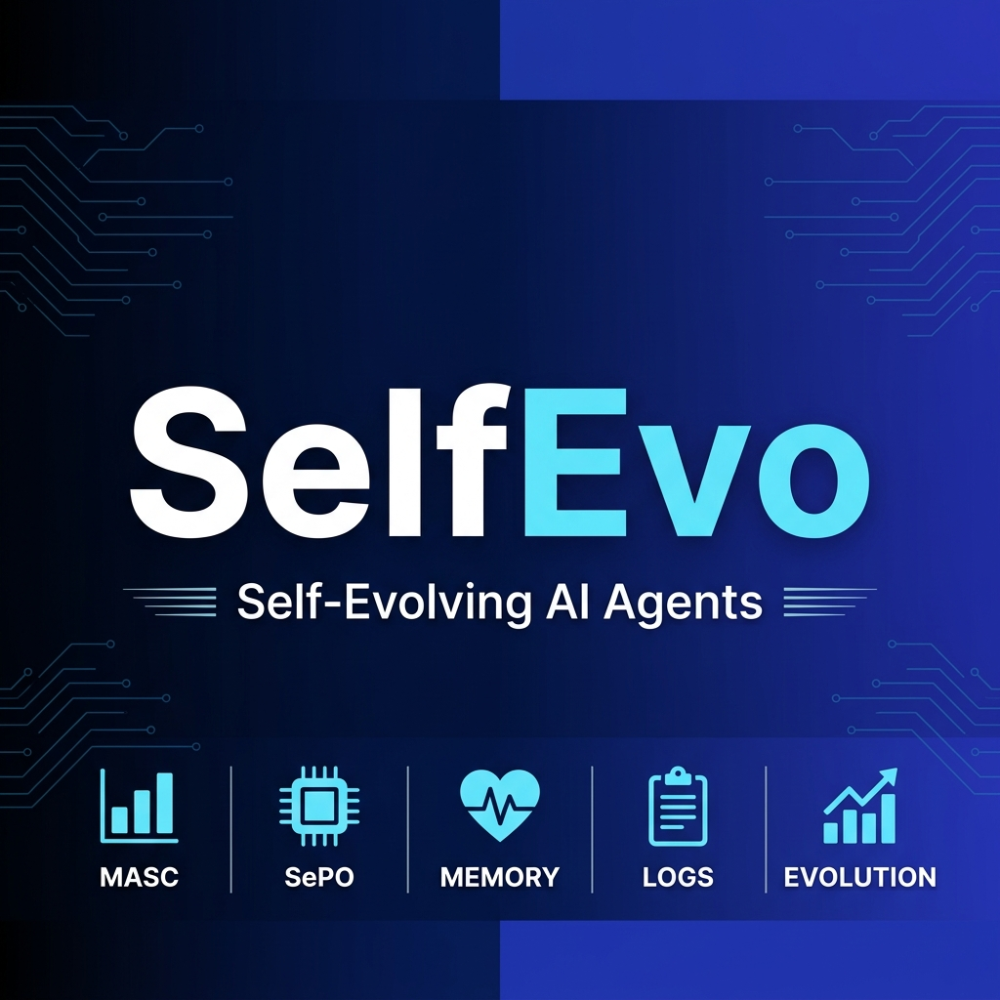

# 🧠 SelfEvo — Self-Evolving Agent Connector Framework

<p align="center">
  
</p>

[](https://python.org)
[](LICENSE)
[](https://fastapi.tiangolo.com)
[](#tests)

A **LLM-agnostic** connector framework that wraps any agent pipeline with automatic validation, self-correction, streaming, async support, conversation memory, and self-evolving prompts — with zero boilerplate.

| Component | Role |
|-----------|------|
| **MASC** | Multi-Aspect Schema Check — auto-validates outputs, detects anomalies, corrects them |
| **SePO** | Self-Evolving Prompt Optimizer — rewrites agent prompts to prevent repeated failures |
| **Connector** | Routes queries, wires MASC + SePO together, logs every run |
| **Memory** | Claude-style `.md` file — per-agent conversation history, auto-injected as context |
| **Dashboard** | Streamlit UI — live KPIs, correction history, evolution timeline |
| **API** | FastAPI server — 9 endpoints for querying, stats, and observability |

> **No vendor lock-in.** Works with OpenAI, Anthropic, Gemini, Ollama, Cohere, Mistral, Azure — or any object with a `.chat(messages) -> str` method. MASC corrections work with **no LLM at all**.

---

## ⚡ Quickstart

```bash
git clone https://github.com/SakuDaku05/SelfEvo.git
cd SelfEvo
pip install -r requirements.txt
python examples/quickstart.py
```

---

## 🔌 Step 1 — Pick your LLM (one line)

```python
# Google Gemini (free tier)
from evolution.llm_protocol import GeminiAdapter
llm = GeminiAdapter(api_key="AIza…", model="gemini-2.5-flash")

# OpenAI
from evolution.llm_protocol import OpenAIAdapter
llm = OpenAIAdapter(api_key="sk-…", model="gpt-4o")

# Anthropic
from evolution.llm_protocol import AnthropicAdapter
llm = AnthropicAdapter(api_key="sk-ant-…")

# Ollama (local, free — no key needed)
from evolution.llm_protocol import OllamaAdapter
llm = OllamaAdapter(model="llama3")

# Any custom provider — just expose .chat(messages) -> str
class MyLLM:
    def chat(self, messages: list[dict]) -> str:
        return my_provider.call(messages)
```

---

## 🏗️ Step 2 — Connect your agents (one line each)

### Option A — wrap any function

```python
from connectors.agent_connector import AgentConnector

connector = AgentConnector(llm_client=llm)

connector.add_fn(
    "sentiment",
    fn=lambda query, **kw: my_sentiment_model(query),
    schema={
        "type": "object",
        "required": ["label", "score"],
        "properties": {
            "label": {"type": "string", "enum": ["positive", "negative", "neutral"]},
            "score": {"type": "number", "minimum": 0, "maximum": 1},
        },
    },
)
```

### Option B — LLM agent in one call

```python
connector.add_llm_agent(
    "summariser",
    llm_client=llm,
    system="Summarise the input in 3 sentences. Reply ONLY with JSON key 'summary'.",
    user_template="Summarise this:\n{query}",
    schema={
        "type": "object",
        "required": ["summary"],
        "properties": {"summary": {"type": "string"}},
    },
)
```

### Option C — chain multiple agents

```python
connector \
    .add_llm_agent("researcher", llm_client=llm, system="...", schema={...}) \
    .add_llm_agent("analyser",   llm_client=llm, system="...", schema={...}) \
    .add_llm_agent("writer",     llm_client=llm, system="...")
```

---

## 🚀 Step 3 — Run

### Sync (classic)

```python
result = connector.run("summariser", "Explain quantum entanglement.")

print(result["output"])      # validated (and corrected if needed) output
print(result["corrected"])   # True if MASC had to fix something
print(result["anomaly"])     # anomaly type dict, or None
print(result["latency_ms"])  # round-trip time
```

### Async

```python
# Single async call — works inside FastAPI, asyncio pipelines, etc.
result = await connector.arun("summariser", "query")

# Parallel fan-out across multiple agents simultaneously
import asyncio
results = await asyncio.gather(
    connector.arun("researcher",  query),
    connector.arun("fact_checker", query),
    connector.arun("analyst",     query),
)
```

Both sync and async agents are supported. Pass an `async def` function to `add_fn()` and it is awaited natively.

### Streaming

```python
# Sync streaming — yields tokens as they arrive
for msg in connector.stream("writer", query):
    if msg["event"] == "chunk":
        print(msg["text"], end="", flush=True)   # live tokens
    elif msg["event"] == "done":
        print()
        if msg["corrected"]:
            print("[MASC fixed:", msg["anomaly"]["type"], "]")

# Async streaming — for FastAPI SSE / WebSocket handlers
async for msg in connector.astream("writer", query):
    if msg["event"] == "chunk":
        await websocket.send_text(msg["text"])
    elif msg["event"] == "done":
        await websocket.send_json({"masc": msg["anomaly"]})
```

MASC validation runs on the fully assembled output after all chunks arrive.

---

## 🗂️ Conversation Memory (Claude-style `.md` file)

Enable persistent per-agent memory in one line:

```python
connector.use_memory("memory.md", inject_turns=5)
```

That's it. Every subsequent `run()` / `arun()` / `stream()` call will:
1. **Inject** the agent's last N conversation turns as context into the prompt
2. **Record** the query and output as a new turn
3. **Log** MASC anomalies and SePO evolution events as notes

The `memory.md` file is human-readable and editable — just like Claude's memory:

```markdown
# SelfEvo Agent Memory

## Agent: summariser
*Last updated: 2025-06-19 10:30:00*

### Conversation
| Turn | Role | Content |
|------|------|---------|
| 2025-06-19 10:28 | user  | Explain quantum entanglement. |
| 2025-06-19 10:28 | agent | {"summary": "Quantum entanglement is..."} |
| 2025-06-19 10:29 | user  | Give a simpler explanation. |
| 2025-06-19 10:29 | agent | {"summary": "Two particles linked..."} |

### MASC Notes
- `2025-06-19 10:28` — anomaly `null_output` detected — **corrected automatically**.

### SePO Events
- `2025-06-19 10:30` — prompt evolved (`heuristic`) due to repeated `null_output` anomalies.
```

**Advanced memory usage:**

```python
from connectors.memory import MarkdownMemory

# Share one memory file across multiple connectors
memory = MarkdownMemory("shared_memory.md", max_turns=100, inject_turns=10)
connector_a.use_memory(memory)
connector_b.use_memory(memory)

# Inspect memory programmatically
print(memory.summary())
# {'summariser': {'turns': 4, 'masc_notes': 1, 'sepo_events': 1}}

# Get context as a message list (OpenAI format)
messages = memory.get_messages("summariser")

# Wipe a specific agent's memory
memory.clear_agent("summariser")
```

---

## 🛡️ MASC — What gets validated automatically

Declare an `output_schema` (JSON Schema) and MASC auto-derives all these rules:

| Rule | What it catches |
|------|----------------|
| `null_output` | None / empty response |
| `type_mismatch` | Wrong top-level type (string instead of object, etc.) |
| `required_fields` | Missing required keys |
| `property_types` | Field values of wrong type |
| `numeric_range` | Numbers outside `minimum`/`maximum` |
| `string_pattern` | Strings not matching `pattern` regex |
| `enum_violation` | Enum fields with undeclared values |
| `empty_array` | Arrays not meeting `minItems` |
| `string_not_empty` | Blank plain-text output |

**No schema?** MASC still validates: output is non-null and non-empty.

### Add a custom rule

```python
from interceptor.masc_validator import ValidationRule

class ToxicityFilter(ValidationRule):
    name = "toxicity_filter"

    def check(self, output, schema):
        if isinstance(output, str) and "badword" in output.lower():
            return {"type": "toxicity_filter", "detail": "Banned term",
                    "field": None, "value": output}

connector.validator.add_rule(ToxicityFilter())
```

---

## 🧬 SePO — Self-Healing Prompts

After `anomaly_threshold` consecutive bad outputs on the same agent:

1. **With LLM** → SePO asks your LLM to rewrite the current prompt to prevent the anomaly.
2. **Without LLM** → SePO appends a targeted patch (e.g. *"CRITICAL: Always return a non-empty JSON object."*).
3. The new prompt is applied automatically and saved to `logs/evolution_history.jsonl` and `memory.md`.

```python
# Trigger evolution after 2 consecutive anomalies (default: 3)
connector = AgentConnector(llm_client=llm, anomaly_threshold=2)
```

---

## 📊 Observability

### Stats

```python
stats = connector.stats()
print(stats["global"]["correction_rate"])       # e.g. 0.23
print(stats["agents"]["summariser"]["total_runs"])
```

### Dashboard

```bash
streamlit run dashboard/app.py
```

5 pages: **Overview KPIs · Agent Drill-Down · Evolution History · Live Logs · MASC Rules**

### API Server

```bash
uvicorn api.server:app --reload
# Swagger UI → http://localhost:8000/docs
```

---

## 🔬 Advanced — full class API with lifecycle hooks

For agents that need custom `on_correction` / `on_evolution` callbacks:

```python
from connectors.base_agent import BaseAgent

class MyAgent(BaseAgent):
    @property
    def agent_id(self): return "my_agent"

    @property
    def output_schema(self):
        return {"type": "object", "required": ["answer"], ...}

    def generate(self, query: str, **kwargs):
        return my_logic(query)

    # Native async — skips thread executor entirely
    async def agenerate(self, query: str, **kwargs):
        return await my_async_logic(query)

    # Real token streaming
    def stream_generate(self, query: str, **kwargs):
        for chunk in self._llm.stream(query):
            yield chunk

    # Called whenever SePO rewrites the prompt
    def on_evolution(self, new_prompt: str):
        self.save_prompt_to_db(new_prompt)

connector.register(MyAgent())
```

---

## 📁 Project Structure

```
SelfEvo/
├── connectors/
│   ├── base_agent.py          # Abstract interface (agenerate, stream_generate hooks)
│   ├── quick_agent.py         # FunctionAgent — wraps any callable, sync or async
│   ├── agent_connector.py     # Orchestrator: run, arun, stream, astream, use_memory
│   └── memory.py              # MarkdownMemory — Claude-style .md conversation store
├── interceptor/
│   ├── masc_validator.py      # 9 schema-driven validation rules + plugin API
│   └── correction_agent.py    # Heuristic + LLM-assisted correction
├── evolution/
│   ├── llm_protocol.py        # 7 LLM provider adapters + protocol
│   ├── sepo_engine.py         # Prompt evolution engine
│   └── evolution_tracker.py   # JSONL history analytics
├── logs/
│   └── logger.py              # Thread-safe JSONL logger + aggregate stats
├── api/
│   └── server.py              # FastAPI (9 endpoints)
├── dashboard/
│   └── app.py                 # Streamlit dashboard (5 pages)
└── examples/
    ├── quickstart.py           # Full demo, no API key needed
    ├── multi_agent_simple.py   # 4-agent pipeline using the one-liner API
    └── agents.py               # Finance, Health, Legal, Sentiment, Echo agents
```

---

## 🧪 Tests

```
tests/
├── test_masc_validator.py        38 tests  (offline)
├── test_correction_agent.py      22 tests  (offline)
├── test_agent_connector.py       17 tests  (offline)
├── test_quick_api.py              8 tests  (offline)
└── test_async_stream_memory.py   14 tests  (offline — async, stream, memory)
                               ─────────────
                               99 tests total, all offline, no API key needed
```

```bash
# Run all offline tests (instant, no API key)
pytest tests/ -v

# Run with live Gemini tests (requires GEMINI_API_KEY in .env)
# Note: add tests/test_gemini_live.py back and run separately
```

---

## 📦 Install

```bash
pip install -r requirements.txt

# Optional LLM SDKs (install whichever you use)
pip install google-genai      # Gemini
pip install openai            # OpenAI / Azure
pip install anthropic         # Anthropic
pip install ollama            # Ollama (local)
pip install cohere            # Cohere
pip install mistralai         # Mistral
```

---

## License

MIT © 2025 — PRs welcome! ⭐ Star the repo if this saves you from a `JSONDecodeError` at 2am.
